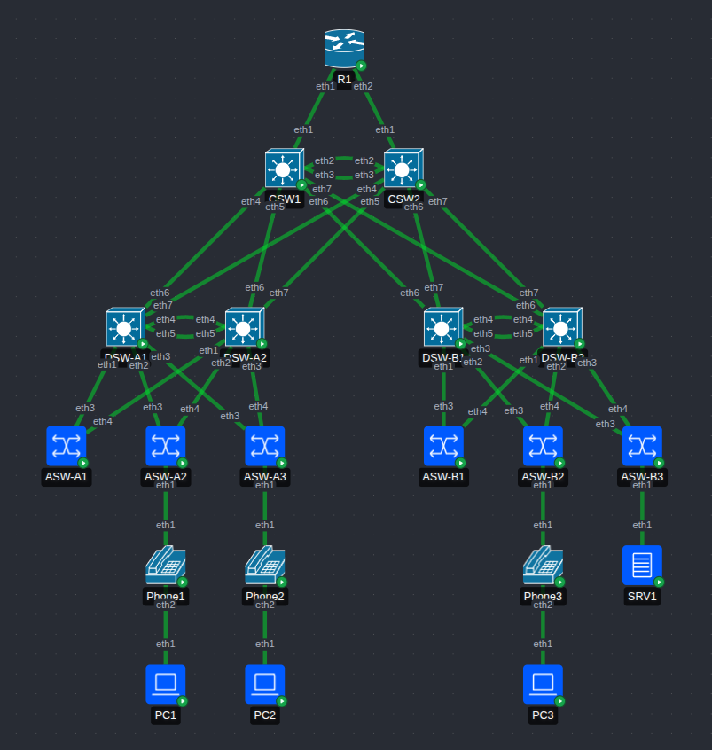

# JITL Mega (c)Lab + Ansible

A couple of weeks before I took the CCNA last May, I did [Jeremy's IT Lab's](https://www.jeremysitlab.com/) Mega Lab in Packet Tracer. It was great practice, and a great lab, except for Packet Tracer getting more and more unusable for crashing the closer I got to the end. So I'm thinking, why not try to reproduce most of it in containerlab?

I have used this lab setup as a crash course in Ansible.

## Deviations from Instructions

### containerlab setup

- I'm using an Arista cEOS image for routers and switches, since it's freely available, relatively lightweight, and substantially similar to IOS. I'm using about 80% of my 32GB available RAM as it is.
- I omitted the Internet node. May change later.
- I have omitted the WLCs and LWAPs for now. Will most likely add these later.
- I represented the phones with Alpine nodes. A virtual bridge will connect to the switches with a trunk link (with untagged traffic in the access VLAN and tagged traffic in the voice VLAN). I will probably configure all this explicitly but might try to make it LLDP-aware in the future.
- AFAIK, clab/EOS doesn't allow me to use the original port numbers, so physical connections has been mapped to flat-indexed Ethernet ports.

### Part 1 - Initial setup

- I skipped this phase entirely. Containerlab handled hostnames, and for my present purposes I'm not concerned about the enable secret or user account Ansible uses.

### Part 2 - VLANs, Layer-2 EtherChannel

- Since PAgP isn't available, I used LACP for both distribution layer port-channels. DTP and VTP aren't in play, either; DTP-related instructions are ignored, and VLANs are pushed to all distribution- and access-layer switches with Ansible instead.
- AFAIK, "voice" VLANs ("phone" VLANs in EOS) are not available in Ansible resource modules, so the voice VLANs on the appropriate ports of E1 on ASW-A2, -A3, and -B2 are declared separately in their respective host_vars files, and attached in a separate, imperative CLI-coded task. (In general I've tried to write my playbooks declaratively with resource modules)

### Part 3 - IP Addresses, Layer-3 EtherChannel, HSRP

- Used LACP again instead of PAgP, and used VRRP instead of HSRP for my FHRP.
- Set VRRP IPs algorithmically.
- SRV1's net configuration will go in containerlab instead of Ansible

### Part 4 - Rapid Spanning Tree Protocol

- Since PVST+ is Cisco proprietary, I used MSTP instead.
- Although this is the shortest and simplest step in the lab (only asking us to configure STP and enable PortFast/BPDUGuard), I thought it would be an interesting exercise to have the STP configuration play ingest the FHRP configuration from the last step and mirror the STP configuration accordingly. Since STP and FHRPs normally ought to be configured alike, I suppose it makes sense to do this with a SSOT.
